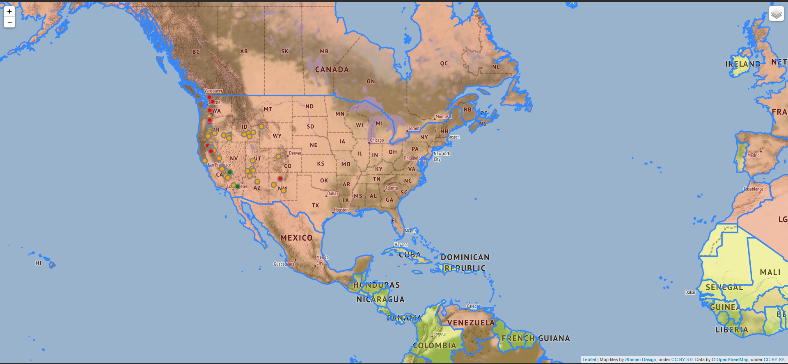
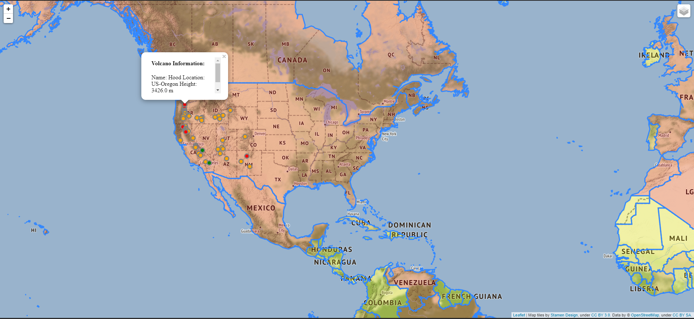

# <h1><strong> Volcano and Population Map</strong></h1>

 Python 🐍  mini project 
  <h2> Libraries used </h2>
  1. Folium: used for visualizing geospatial data  
  2. Pandas: for data manipulation and analysis.  

<h2> Gallery </h2>

  
 

